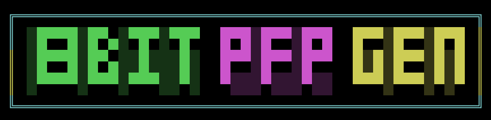

🎮 Pixel-PFP 🕹️
**Generate retro-styled 8-bit profile pictures from text prompts!**

<p align="center">
  
</p>

## ✨ Features
Pixel-PFP uses AI to generate amazing retro-styled profile pictures from simple text prompts:
- 🤖 **AI-Powered Generation**: Create unique images using StableDiffusion models
- 🎨 **8-bit Style Conversion**: Multiple conversion methods including K-means clustering + Floyd-Steinberg dithering
- 🚀 **Dual Backends**: Choose between PyTorch or Rust-based Candle framework
- ⚡ **Optimized Performance**: Rust implementation offers 3-5x speed boost
- 🎭 **Customizable Effects**: Control palette size (4-256 colors), pixel size, and dithering intensity

## 🖼️ Examples
*Coming soon - placeholder for example images grid*

## 🔧 Installation
**Prerequisites:**
- Python 3.8+
- Rust 1.65+ (for Candle backend)

```bash
# Python dependencies
pip install torch diffusers pillow scikit-learn

# Rust components (optional)
cargo install --path candle-components
```

## 🚀 Usage
**Basic Command:**
```bash
python generate.py --prompt "cyberpunk cat warrior" \
                   --method rust \
                   --palette-size 8 \
                   --pixel-size 12 \
                   --output avatar.png
```

**Options:**
| Flag            | Description                          | Default     |
|-----------------|--------------------------------------|-------------|
| `--prompt`      | Text prompt for generation           | Required    |
| `--method`      | Conversion method (basic/pyxelate/rust) | rust     |
| `--palette-size`| Colors in final image (4-256)        | 8           |
| `--pixel-size`  | Pixel block size                     | 8           |
| `--dithering`   | Enable dithering (true/false)        | true        |
| `--output`      | Output path                          | output.png  |

## 🛠️ Project Roadmap
**In Progress**  
✅ Basic 8-bit conversion pipeline  
✅ Rust backend implementation  
🟧 [ ] 8-bit quantized model support  
🟧 [ ] 4-bit quantized model optimization  
🟧 [ ] New Rust pixelation engine (replacing Pyxelate)  
🟧 [ ] Classic console palettes (NES, Game Boy, C64)  
🟧 [ ] Batch processing mode  

**Future Enhancements**  
[ ] Web-based interface  
[ ] Animated pixel art generation  
[ ] Cross-platform desktop app  
[ ] Social media integration  
[ ] NFT export capabilities  

## 🧰 Technical Details
**Core Components:**
- **Image Generation**  
  - PyTorch: `diffusers` Stable Diffusion pipeline  
  - Rust: Candle framework with LORA adapters  

**Pixelation Engine**  
| Method       | Language | Features                      | Speed  |
|--------------|----------|-------------------------------|--------|
| Basic        | Python   | K-means + Floyd-Steinberg     | 1x     |
| Pyxelate     | Python   | Advanced dithering            | 0.8x   |
| Rust         | Rust     | SIMD optimized pipelines       | 3-5x   |

## 📝 Contributing
We welcome contributions! Priority areas:
- Performance optimizations
- New pixelation algorithms
- Additional model support
- Web UI development
- Documentation improvements

## 📄 License
MIT License - See [LICENSE](LICENSE) for details

## 🙏 Acknowledgements
- Stability AI for Stable Diffusion models
- Pyxelate by @dandrino
- Candle ML framework
- Open source contributors everywhere!

---
<p align="center">
Made with ❤️ and a lot of pixels</p>